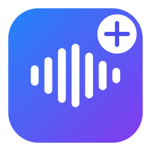

# OmniScribe

[](https://github.com/ep1sode-33/WhisperScribe/actions/workflows/ci.yml)

A native macOS app that turns audio files or stacks of images into clean text. Drop
files in — audio is transcribed locally on the Neural Engine (WhisperKit), images are
OCR'd locally on the GPU (DeepSeek-OCR-2 via mlx-swift), and an optional BYOK LLM
merges, deduplicates and polishes the result.

<p align="center">
  
</p>

> **Name heritage:** the app began as **WhisperScribe** (audio-only) and grew image OCR
> plus multi-file merge into **OmniScribe**. The user-facing display name is now
> **OmniScribe**, but the repository, Xcode project, app bundle, scheme, and `.dmg` are
> still named **WhisperScribe** — so on-disk paths like `/Applications/WhisperScribe.app`
> below are correct.

## Features

- 🎙️ **Local audio transcription** via [WhisperKit](https://github.com/argmaxinc/WhisperKit) 1.0 (Whisper large-v3) on the **Apple Neural Engine** — low power, no audio leaves your Mac.
- 🖼️ **Local image OCR** via **DeepSeek-OCR-2** running on the **GPU** through [mlx-swift](https://github.com/ml-explore/mlx-swift) — a bit-for-bit Swift port packaged as [DeepSeekOCR2Kit](DeepSeekOCR2Kit/README.md); no Python runtime, nothing leaves your Mac.
- 📦 **Any container** — drop `.mp4/.mov/.m4a/.mp3/.wav/.aac/.caf …` audio (decoded in-app with AVFoundation, `ffmpeg` fallback for exotic codecs) or `.png/.jpg/.jpeg/.heic/.webp/.tiff` images. A drop is classified as an **all-audio** or **all-image** batch, natural-sorted by filename; mixing the two kinds is rejected with a clear error.
- 🧩 **Multi-file batch plays** — the point of a batch is *one clean document out*:
  - **Scrolling screenshots → one deduped `.txt`.** Drop the 4 overlapping screenshots of a long article; each is OCR'd, then the LLM stitches them into a single document and drops the repeated overlap.
  - **Split recording → per-segment `.srt` + one merged `.txt`.** Drop the 2 halves of a talk; each half gets its own timeline `.srt`, and the prose is merged into one continuous `.txt`.
- 🧹 **Optional LLM cleanup & merge** (BYOK, OpenAI-compatible) in **4 levels**, with a timestamp-preserving two-pass design so subtitle timing is never corrupted. The merge step is **fail-open**: if the LLM is unreachable it degrades to an ordered, headed concatenation and warns you, never failing the job.
- 📝 **SRT + TXT** output next to the source file (or a folder you choose).
- 🌐 **5 languages** — English, 简体中文, 繁體中文, 日本語, 한국어.
- 📊 **Honest progress** — a determinate bar for transcription (bound to WhisperKit's own progress), a live "characters generated" counter during streaming LLM cleanup, and per-file progress across a batch.

## Install

Download the latest `WhisperScribe-<version>.dmg` from
[Releases](https://github.com/ep1sode-33/WhisperScribe/releases), open it and drag
**OmniScribe** into **Applications**.

The app is **ad-hoc signed** (not notarized), so on first launch Gatekeeper will
claim it is "damaged". Clear the quarantine flag once and it opens normally (the app
bundle on disk is still `WhisperScribe.app` — see *Name heritage* above):

```bash
xattr -dr com.apple.quarantine /Applications/WhisperScribe.app
```

Prefer building from source? See [Build & run](#build--run).

## Requirements

- **macOS 14** (Sonoma) or later, **Apple Silicon** (M-series).
- **Xcode 16+** to build (developed on Xcode 26).
- A **WhisperKit CoreML model** for audio — the app downloads one for you on first run (pick it in Settings ▸ Model); no manual setup.
- A **DeepSeek-OCR-2 checkpoint** for images (~3GB) — downloaded on demand from **Settings ▸ Model**; only needed if you OCR images.
- *(optional)* [`ffmpeg`](https://ffmpeg.org) on `PATH` at `/opt/homebrew/bin/ffmpeg` — only used as a fallback for containers AVFoundation can't open.
- *(optional)* a BYOK OpenAI-compatible chat endpoint for the cleanup / merge feature.

## Build & run

```bash
open WhisperScribe.xcodeproj    # then press ⌘R
```

or from the command line:

```bash
xcodebuild -project WhisperScribe.xcodeproj -scheme WhisperScribe \
  -configuration Debug -destination 'platform=macOS' \
  -skipPackagePluginValidation -skipMacroValidation build
```

> `-skipPackagePluginValidation -skipMacroValidation` are **required** for headless
> builds since the WhisperKit 1.0 / mlx-swift bump — those packages ship build plugins
> and macros that otherwise block a non-interactive build waiting for approval.

The app is unsandboxed and ad-hoc signed ("Sign to Run Locally") — no developer
account needed to run it on your own Mac. Distributable `.dmg`s are built
automatically by [the release workflow](.github/workflows/release.yml) when a
`v*` tag is pushed; for a one-off local build use **Product ▸ Archive**.

## Usage

1. Drag files onto the window (or click **Choose Files…**) — one or more audio files, or one or more images. A batch must be all one kind.
2. **First run:** open **Settings** (⌘,) → **Model** and pick a Whisper model (large-v3, large-v3-turbo, or distil-large-v3); it downloads itself with a progress bar. To OCR images, download the **DeepSeek-OCR-2** model (~3GB) from the same **Model** section. Also here: cleanup level, language, output location, and your BYOK LLM endpoint (then **Test Connection**).
3. Watch it transcribe / OCR → clean → merge → export. Outputs land next to the source by default. `.srt` is **audio-only**: a single audio file keeps its `.srt` + `.txt`, while a single image produces just one merged `.txt` (no `.srt`); a multi-file batch writes per-file `.srt` (audio only) and one merged `.txt`.

### Cleanup levels

| Level | What it does |
|-------|--------------|
| **L0 Raw** | Whisper / OCR output verbatim — no LLM. |
| **L1 Fix-only** | Punctuation, casing, homophones, proper nouns/terminology. Every word kept. |
| **L2 Clean + polish** | L1 + remove filler/stutters, fix grammar, add paragraph breaks. Meaning preserved. |
| **L3 Polish + light edit** | L2 + light condensing/reordering for readability (TXT only). |

> The **SRT is always capped at L2 semantics** (segment-local edits) so timestamps stay
> exactly aligned to the audio; L3's reflow applies only to the flowing-prose `.txt`.
> If the LLM is unreachable or misconfigured, cleanup **degrades gracefully to raw**
> output and warns you — it never fails the job or corrupts timing.

### Bring-your-own-key (LLM)

Any OpenAI-compatible `/chat/completions` endpoint works — enter `base_url`, `api_key`,
`model` in Settings (all blank by default; the key is stored in the **Keychain**). The
client streams responses (SSE) and reads both `content` and `reasoning_content`. The
same endpoint drives both per-file cleanup and the multi-file merge/dedup pass.

> **Reasoning models** (e.g. DeepSeek V4) "think" a lot, so batched cleanup of a whole
> transcript is slow. For fast bulk cleanup, point it at a non-thinking model or use L1.

## Architecture

```
ContentView ─ DropZone ─ StatusView ─ SettingsView              (SwiftUI)
        │
TranscriptionViewModel   (@MainActor state machine, cancellable batch pipeline)
        │
        ├─ BatchClassifier      sorts a drop into an all-audio or all-image batch
        │                       (natural filename order; mixed / unsupported → error)
        │
        ├─ audio ─┬─ AudioExtractor      AVFoundation → 16 kHz mono Float (ffmpeg fallback)
        │         ├─ TranscriberService  actor; WhisperKit 1.0 on ANE; progress via Foundation Progress KVO
        │         ├─ LLMCleaner          actor; BYOK SSE streaming; two-pass, indexed 1:1 JSON, fail-closed
        │         └─ SubtitleWriter      SRTFormatter + CJK-aware TextJoiner + FileNaming → .srt/.txt
        │
        ├─ images ─ OCRService           actor over DeepSeekOCR2Kit (OCR2Session); on-GPU DeepSeek-OCR-2, EXIF-aware
        │
        ├─ MergeService         actor; BYOK LLM merge/dedup of multi-file transcripts; fail-open concatenation
        │
        └─ ModelManager · OCRModelManager   on-disk readiness + download for the Whisper / DeepSeek-OCR-2 checkpoints
```

Notable choices: transcription progress is read from WhisperKit's own `Progress`
object (the segment callback gives block-relative timestamps under VAD chunking).
The LLM SRT pass sends an indexed JSON array and requires the same indices back
(strict 1:1), validating set-equality + length ratios and falling back to raw text
per-batch on any mismatch. Image OCR runs entirely on-GPU via
[DeepSeekOCR2Kit](DeepSeekOCR2Kit/README.md) — a bit-for-bit Swift port of the
`mlx-vlm` reference, parity-tested against golden tensors. The multi-file merge is
deliberately **fail-open** (an ordered concatenation is always better than no output),
in contrast to the fail-closed SRT cleanup. UI strings use an Xcode **String Catalog**
(`Localizable.xcstrings`) with English semantic keys.

## Project layout

```
WhisperScribe/
├─ App/          WhisperScribeApp, AppModel
├─ Views/        ContentView, DropZone, StatusView, SettingsView
├─ ViewModel/    TranscriptionViewModel                 (audio + image batch orchestration)
├─ Services/     TranscriberService, AudioExtractor, LLMCleaner, LLMPrompts, LLMTransport,
│                OCRService, MergeService, SubtitleWriter,
│                ModelManager, OCRModelManager, WhisperKitDownloader, ModelDownloading
├─ Persistence/  SettingsStore, KeychainStore
├─ Support/      BatchClassifier, SRTFormatter, TextJoiner, FileNaming
├─ Models/       TimedSegment, CleanupLevel, JobState, AppError, LLMConfig, Preferences, WhisperModel
└─ Localizable.xcstrings

DeepSeekOCR2Kit/   local DeepSeek-OCR-2 inference on mlx-swift (SwiftPM package) — see
                   DeepSeekOCR2Kit/README.md for the API, CLI, and parity story.
```

## License

[MIT](LICENSE) © 2026 William.
